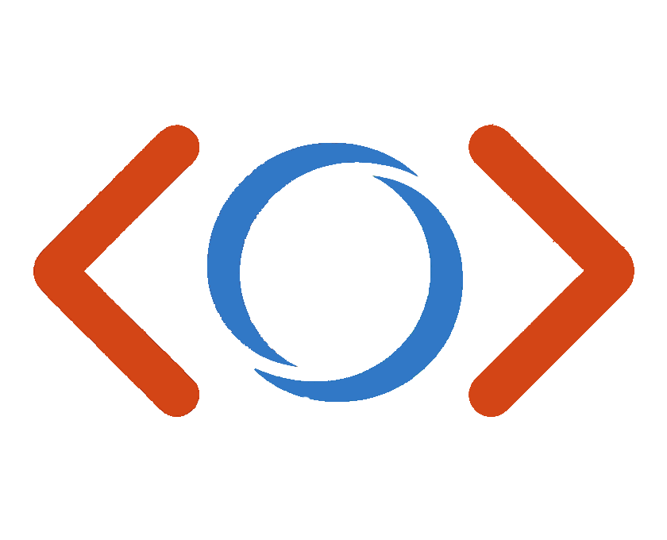

<div align="center">
  
  <h1>Tyzen</h1>
  <p><b>Type-safe Rust ↔ TypeScript generation</b></p>
  <a href="https://crates.io/crates/tyzen"></a>
  <a href="https://crates.io/crates/tyzen"></a>
  <a href="https://docs.rs/tyzen"></a>
  <a href="https://crates.io/crates/tyzen"></a>
</div>

Tyzen is a high-performance developer tool that bridges the gap between **Rust** and **TypeScript**. Its primary goal is to provide a seamless, type-safe development experience (DX) by automating the synchronization of data structures and API definitions.

While Tyzen was built with **Tauri** in mind, its core is a generic, lightning-fast type generator that can be used in any Rust/TS project.

## Quick Links

- [Quick Start](#quick-start)
- [Tauri Integration](#tauri-integration)
- [Generated Output](#example-generated-output-bindingsts)
- [Namespace Guide](#namespace-pattern)
- [Error Guide](#error-handling-pattern)
- [Zod Guide](#zod-schema-generation)
- [Typed Events](#typed-events)
- [Feature Guide](#-feature-guide)
- [Benchmark Results](#benchmark-results)
- [Roadmap](#-roadmap--status)

## Why Tyzen?

- **Performance**: Generates complex TypeScript bindings in milliseconds.
- **Developer Experience (DX)**: Zero-config command registration and strongly-typed events.
- **Transparency**: Keeps your code clear and explicit.
- **Tauri Integration**: First-class support for Tauri commands and events with automatic registration.

## Benchmark Results

Latest committed benchmark artifacts are in [`tyzen/bench/results`](./tyzen/bench/results).

| Benchmark               |    Median    |     P95      | Notes                                                                            |
| :---------------------- | :----------: | :----------: | :------------------------------------------------------------------------------- |
| `e2e-generate`          |  `0.132 ms`  |  `0.233 ms`  | Real `tyzen::generate(...)` flow, small realistic fixture (`2824` bytes output). |
| `e2e-heavy-generate`    |  `5.993 ms`  |  `7.193 ms`  | Real `tyzen::generate(...)` flow, heavy fixture (`542292` bytes output).         |
| `cold-process-generate` | `293.804 ms` | `961.796 ms` | Full cold process startup + generate (includes process bootstrap variance).      |
| `codegen-large`         |  `3.404 ms`  |  `3.939 ms`  | Synthetic renderer throughput (`1000` types, `24` fields/type).                  |

Reproduce locally:

```bash
cargo bench -p tyzen --bench codegen
cargo bench -p tyzen --bench e2e
cargo bench -p tyzen --bench e2e_heavy
./tyzen/bench/scripts/run_cold_generate.sh 6 1
```

For full benchmark methodology and output formats, see [`tyzen/bench/README.md`](./tyzen/bench/README.md).

---

## Comparison: Tyzen vs tauri-specta vs ts-rs

Tyzen already covers the core job people usually reach for `ts-rs` for: deriving TypeScript from Rust structs/enums with Serde-aware naming, optional fields, flattening, tagged enums, generics, and deterministic output.

The bigger difference is scope. `ts-rs` is a mature type-export crate. `tauri-specta` is part of the Specta stack, where `specta` provides type introspection/export, `rspc` provides end-to-end typed APIs, and `tauri-specta` provides typed Tauri commands. Tyzen is narrower than the full Specta ecosystem, but deeper on the Tauri DX it owns: generated command wrappers, events, namespaces, binary hydration, result/error handling, constants, and a predictable single-file SDK-style output.
Tyzen's killer DX feature for Tauri teams is that `.invoke_handler(tyzen_tauri::handler!())` auto-collects all macro-registered handlers, while Specta-based setups typically require explicit manual handler lists, which is easier to drift and gives weaker command-surface autocomplete ergonomics.

| Capability                    | Tyzen                                                        | tauri-specta                                                         | ts-rs                                                      |
| :---------------------------- | :----------------------------------------------------------- | :------------------------------------------------------------------- | :--------------------------------------------------------- |
| Primary focus                 | Rust -> TS type generation + Tauri command/event DX          | Typed Tauri commands/events on top of Specta                         | Rust -> TS type generation                                 |
| Tauri command wrappers        | ✅ Built-in via `tyzen-tauri`                                | ✅ Built-in                                                          | ❌ Not primary scope                                       |
| Event typing for Tauri        | ✅ Built-in event helpers                                    | ✅ Supported                                                         | ❌ Not primary scope                                       |
| Namespace-oriented SDK output | ✅ First-class (`module_ns!`, rename strategy)               | ⚠️ Depends on your Specta export style                               | ⚠️ Manual conventions                                      |
| Serde-oriented type mapping   | ✅ Core goal                                                 | ✅ Via Specta + serde integrations                                   | ✅ Core goal                                               |
| Export granularity            | Single generated bindings file by default                    | Exporter-driven                                                      | Per-type export and dependency export                      |
| Advanced per-field overrides  | Partial (`rename`, `skip`, `flatten`, `optional`, `binary`)  | Specta-driven                                                        | Mature (`type`, `as`, `inline`, `skip`, optional variants) |
| Generic edge cases            | Common generics                                              | Strong type graph model                                              | Mature escape hatches (`concrete`, `bound`)                |
| External crate coverage       | Growing (`uuid`, `chrono`, `anyhow` features)                | Broad feature ecosystem                                              | Broad Rust type coverage                                   |
| Ecosystem coupling            | Low to medium (Tyzen crates)                                 | Medium to high (Specta/rspc/tauri-specta alignment)                  | Low                                                        |
| Good default when...          | You want typed Tauri IPC + predictable generated API surface | You already use Specta/rspc or want a shared type graph across tools | You only need mature standalone TS type exports            |

### Decision Guide

- Choose **Tyzen** when you want type export, Tauri command wiring, event helpers, and frontend ergonomics in one explicit generator flow.
- Choose **tauri-specta** when you already use Specta/rspc, want to share one type graph across that stack, or prefer Specta's exporter model.
- Choose **ts-rs** when your use case is pure model syncing and you need its mature escape hatches for custom type overrides, inlining, concrete generics, or per-type export layout.

Reference links:

- `tauri-specta`: https://github.com/specta-rs/tauri-specta
- `specta`: https://github.com/specta-rs/specta
- `ts-rs`: https://github.com/Aleph-Alpha/ts-rs

---

<a id="quick-start"></a>

## Quick Start

### 1. Add Dependencies

For core type generation:

```bash
cargo add tyzen
cargo add serde --features derive
```

For **Tauri** integration (Optional):

```bash
cargo add tyzen-tauri
```

### 2. Define Your Types (Rust)

Tyzen uses simple attributes to mark structs, enums, and functions.

```rust
use serde::{Serialize, Deserialize};

// 1. Convert any Rust struct/enum to TS
#[derive(tyzen::Type, Serialize, Deserialize)]
pub struct User {
    pub id: u32,
    pub name: String,
}

// 2. Define a typed Event
#[derive(tyzen::Type, tyzen::Event, Serialize)]
pub struct WelcomeEvent {
    pub message: String,
}
```

### 3. Setup the Generator

Run generation before frontend type-check/build so `bindings.ts` always matches Rust.

- Core (non-Tauri):

```rust
fn main() {
    tyzen::generate("../src/bindings.ts").expect("failed to generate bindings");
}
```

- Tauri (recommended default):

```rust
fn main() {
    #[cfg(debug_assertions)]
    tyzen_tauri::generate("../src/bindings.ts").expect("failed to generate bindings");

    tauri::Builder::default()
        .invoke_handler(tyzen_tauri::handler!())
        .run(tauri::generate_context!())
        .expect("error while running tauri application");
}
```

- Tauri with config (for example `Option<T> -> field?: T`):

```rust
fn main() {
    #[cfg(debug_assertions)]
    tyzen_tauri::generate_with_config(
        "../src/bindings.ts",
        tyzen::GeneratorConfig {
            option_fields_as_optional: true,
            ..Default::default()
        },
    )
    .expect("failed to generate bindings");

    tauri::Builder::default()
        .invoke_handler(tyzen_tauri::handler!())
        .run(tauri::generate_context!())
        .expect("error while running tauri application");
}
```

- Non-Tauri workflow (`package.json`):

```rust
// src/bin/gen_bindings.rs
fn main() {
    tyzen::generate("../frontend/src/bindings.ts").expect("failed to generate bindings");
}
```

```json
{
  "scripts": {
    "gen:bindings": "cargo run --bin gen_bindings",
    "build": "pnpm gen:bindings && tsc -b && vite build"
  }
}
```

If backend is in another workspace package:

```bash
cargo run -p backend --bin gen_bindings
```

- Tyzen rewrites the target file only when generated content actually changes.

---

<a id="tauri-integration"></a>

## Tauri Integration

For Tauri projects, `tyzen-tauri` provides a wrapper that automates command registration and event handling.

### 1. Define Tauri Commands

No stacked macros needed! The `#[tyzen_tauri::command]` macro automatically expands and registers your commands with Tauri under the hood.

```rust
#[tyzen_tauri::command] // Marks for TS generation & auto-registers with Tauri
pub fn create_user(name: String) -> Result<User, String> {
    Ok(User { id: 1, name })
}
```

### 2. Setup Generator & Handler

```rust
fn main() {
    // 1. Generate TS bindings with Tauri support
    #[cfg(debug_assertions)]
    tyzen_tauri::generate("../src/bindings.ts").expect("failed to generate bindings");

    // 2. Setup Tauri with auto-registration
    tauri::Builder::default()
        .invoke_handler(tyzen_tauri::handler!()) // Auto-registers all #[tyzen_tauri::command]
        .run(tauri::generate_context!())
        .expect("error while running tauri application");
}
```

---

## Frontend Usage (TypeScript/React)

Tyzen creates a clean, intuitive API for your frontend.

```tsx
import { useEffect, useState } from 'react';
import { commands, events } from './bindings';

function App() {
  const [status, setStatus] = useState('Ready');

  useEffect(() => {
    // Listen once when component mounts
    const unlisten = events.welcome.listen(payload => {
      setStatus(`Message: ${payload.message}`);
    });

    return () => {
      unlisten.then(f => f());
    };
  }, []);

  const handleCreateUser = async () => {
    // Command calls can be made anywhere (button click, form submit, effect, etc.)
    const res = await commands.createUser('rzust');
    if (res.status === 'ok') console.log('Success:', res.data);
  };

  return (
    <>
      <button onClick={handleCreateUser}>Create user</button>
      <h1>{status}</h1>
    </>
  );
}
```

### Example Generated Output (`bindings.ts`)

Tyzen output is plain TypeScript. This is what your frontend imports directly:

```ts
// auto-generated by tyzen, do not edit
export type User = { id: number; name: string };

export type Result<T, E = string> =
  | { status: 'ok'; data: T }
  | { status: 'error'; error: E };

export const commands = {
  createUser: (name: string) => __invoke<Result<User>>('create_user', { name }),
};

export const events = {
  onWelcome: (cb: (payload: { message: string }) => void) =>
    __listen('welcome', cb),
};
```

What this gives you:

- Rust snake_case command names become camelCase frontend functions.
- Return values are strongly typed (`Result<User>` in this example).
- Event payloads are typed at subscription sites.

---

## Feature Guide

### Standard Type Conversion

Use `#[derive(tyzen::Type)]` on any Rust type. It supports primitives, `Vec`, `Option`, `HashMap`, and even complex **Generics**.

### Tauri Commands

The `#[tyzen_tauri::command]` macro is the only attribute you need to declare a type-safe Tauri command. It automatically handles code generation and expands `#[tauri::command]` so there is zero boilerplate or stacked-macro footguns.

<a id="namespace-pattern"></a>

## Namespace Pattern

Use namespaces when you want an SDK-like frontend API (`Task.getAll()`) instead of one flat command list.

How namespace resolution works:

- `tyzen::module_ns!("Task")` sets a default namespace for that module tree.
- `#[tyzen(ns = "...")]` on a specific type/command/event overrides module default.
- Output includes both:
  - global type definitions (`TaskItem`, `User`, ...)
  - namespaced action objects (`Task`, `Auth`, ...)

Command naming inside a namespace:

- Default strategy is `Prefix`.
- With namespace `Task`, `task_get_all` becomes `Task.getAll`.
- `Postfix` strategy is also supported, so `get_all_task` becomes `Task.getAll`.
- `#[tyzen(rename = "...")]` on a command wins over auto strip logic.

```rust
tyzen::module_ns!("Task");

#[derive(tyzen::Type)]
pub struct TaskItem {
    pub id: u64,
    pub title: String,
}

#[tyzen::command]
pub fn task_get_all() -> Vec<TaskItem> {
    vec![]
}
```

Generated frontend shape:

```ts
import { Task } from './bindings';

const res = await Task.getAll();
```

If your team prefers postfix names (`get_all_task` style), set naming strategy:

```rust
tyzen_tauri::generate_with_config(
    "../src/bindings.ts",
    tyzen::GeneratorConfig {
        naming_strategy: tyzen::NamingStrategy::Postfix,
        ..Default::default()
    },
)?;
```

Per-command explicit rename (works for both core and tauri command attrs):

```rust
#[tyzen::command(ns = "Task", rename = "getAll")]
pub fn task_get_all() -> Vec<TaskItem> {
    vec![]
}
```

<a id="error-handling-pattern"></a>

## Error Handling Pattern

Keep backend errors typed in Rust, then map them to short UI-friendly messages in frontend.

Rust example:

```rust
#[derive(tyzen::Type, thiserror::Error, serde::Serialize)]
pub enum ProjectError {
    #[error("project title already exists")]
    TitleExists,
    #[error("project not found: {id}")]
    NotFound { id: u64 },
    #[error("db unavailable")]
    DbUnavailable,
}

#[tyzen_tauri::command]
pub fn project_create(title: String) -> Result<Project, ProjectError> {
    // ...
    # unimplemented!()
}
```

Generated output shape (simplified):

```ts
export type ProjectError =
  | { kind: 'TitleExists'; message: string }
  | { kind: 'NotFound'; id: number; message: string }
  | { kind: 'DbUnavailable'; message: string };

export const ProjectErrorMeta = {
  TitleExists: { code: 'TITLE_EXISTS' },
  NotFound: { code: 'NOT_FOUND' },
  DbUnavailable: { code: 'DB_UNAVAILABLE' },
};
```

Frontend handling (short pattern):

```ts
import { parseError, ProjectErrorMeta } from './bindings';

const res = await commands.projectCreate(payload);
if (res.status === 'error') {
  const uiError = parseError(res.error, ProjectErrorMeta);

  switch (uiError.code) {
    case 'TITLE_EXISTS':
      toast.error('Title already exists');
      break;
    case 'NOT_FOUND':
      toast.error('Project not found');
      break;
    default:
      toast.error(uiError.message);
  }
}
```

<a id="zod-schema-generation"></a>

## Zod Schema Generation

What is already supported:

- Opt-in schema generation with `#[tyzen(schema)]`.
- Struct schema generation (`z.object(...)`) for common field types.
- Unit enums to `z.enum([...])`.
- Basic validation sync (`min/max/regex`, numeric bounds).
- Generated inferred schema aliases (`z.infer<typeof ...>`).

What will be added next:

- Tagged/untagged payload enum schemas (discriminated union style support).
- Better explicit fallback visibility when generation must use `z.any()`.
- Broader external type mapping and deeper nested schema coverage.

Rust example:

```rust
#[derive(tyzen::Type)]
#[tyzen(schema)]
pub struct CreateProjectDto {
    #[validate(length(min = 2, max = 60))]
    pub title: String,
    pub priority: Priority,
    pub target_date: Option<String>,
}

#[derive(tyzen::Type)]
pub enum Priority {
    Low,
    Medium,
    High,
}
```

Generated output example (`bindings.ts`):

```ts
import { z } from 'zod';

export type CreateProjectDto = {
  title: string;
  priority: Priority;
  target_date: string | null;
};

export const prioritySchema = z.enum(['Low', 'Medium', 'High']);
export type PrioritySchema = z.infer<typeof prioritySchema>;

export const createProjectDtoSchema = z.object({
  title: z.string().min(2).max(60),
  priority: z.enum(['Low', 'Medium', 'High']),
  target_date: z.union([z.string(), z.date()]).nullable().optional(),
});
export type CreateProjectDtoSchema = z.infer<typeof createProjectDtoSchema>;
```

<a id="typed-events"></a>

## Typed Events

When you derive `tyzen::Event`, Tyzen adds a helper `.emit(&handle)` method to your struct:

```rust
let event = WelcomeEvent { message: "Hi!".into() };
event.emit(&handle).ok(); // Correctly types the payload for the frontend
```

---

## Roadmap & Status

| Feature               | Importance     | Notes                                                                                                             |
| :-------------------- | :------------- | :---------------------------------------------------------------------------------------------------------------- |
| **Full Serde Parity** | Implemented    | `flatten`, `alias`, `default`, and `rename_all` support. Requires inter-type metadata.                            |
| **Binary Data**       | Implemented    | Automatically maps `Vec<u8>` or fields marked with `#[tyzen(binary)]` to `Uint8Array` with transparent hydration. |
| **Result & Error**    | Implemented    | Deep support for custom Rust error types and enum variant metadata blocks in frontend.                            |
| **Constant Export**   | Implemented    | Sync `pub const` logic values from Rust to TS.                                                                    |
| **Namespaces**        | Implemented    | Organize types and commands into logical Models (SDK style).                                                      |
| **Zod Support**       | Implemented    | Generate Zod schemas alongside types for runtime frontend validation.                                             |
| **Mock Client**       | Will implement | Generate mock JS/TS clients for testing/UI prototyping without the backend.                                       |
| **Doc Propagation**   |                | Transform Rust doc comments (`///`) into TSDoc (`/** ... */`).                                                    |

---

## Packages

- `tyzen`: The core engine for type conversion.
- `tyzen-macro`: Procedural macros for `Type` and `Event`.
- `tyzen-tauri`: Specialized integration for Tauri (commands, event emitters, and TS glue code).

## Contributing

You can contribute even if this is your first OSS project:

- Open an issue describing bug/feature before large changes.
- Fork, create a branch, and open a PR with a focused diff.
- Add or update tests for behavior changes in `tyzen/tests` or `tyzen-tauri/tests`.
- Include before/after snippets for generated TypeScript when relevant.

Small first contributions that help a lot:

- Add coverage for edge-case Serde mappings.
- Improve docs/examples around command/event patterns.
- Add mappings for common external Rust types.

## License

Distributed under the MIT / Apache-2.0 License.
